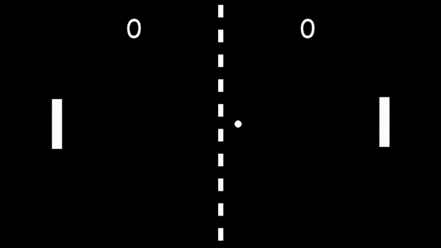
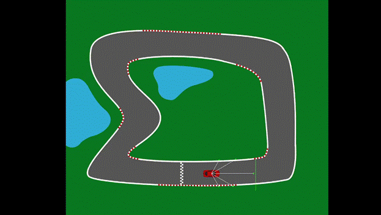
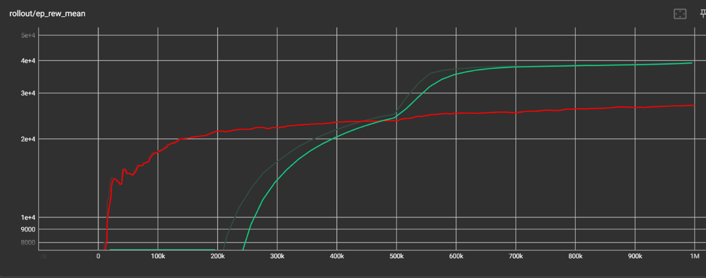
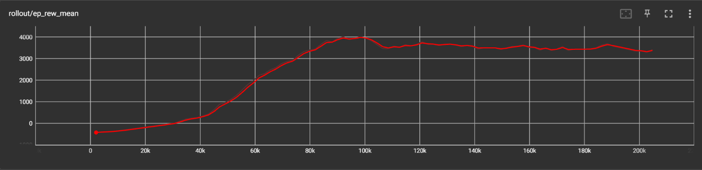

# Deep Learning Game Bots - Reinforcement Learning Projects

Two AI agents that learn to play games and drive cars using deep reinforcement learning. This project demonstrates how different RL algorithms can be applied to game playing and autonomous driving, with agents learning optimal strategies through trial and error.

## 🎮 Projects Included

### 1. Pong Bot (DQN & A2C)
AI agent that masters the classic Pong game using two different algorithms for comparison.



*Pong Bot Demo*

### 2. Self-Driving Car (PPO)
AI agent that learns to navigate and drive autonomously using Proximal Policy Optimization.



*Self-Driving Car Demo*

## 🌟 Features

### Pong Bot
- **DQN (Deep Q-Network)**: Value-based RL algorithm
- **A2C (Advantage Actor-Critic)**: Policy gradient algorithm
- **Algorithm Comparison**: Compare performance of DQN vs A2C
- **Custom Gym Environment**: Custom Pong environment built with Pygame

### Self-Driving Car
- **PPO (Proximal Policy Optimization)**: Advanced policy gradient algorithm
- **Continuous Control**: Smooth steering and acceleration
- **Custom Environment**: Realistic driving simulation
- **Obstacle Avoidance**: Learn to navigate safely

### Common Features
- **Training Visualization**: TensorBoard integration for monitoring training progress
- **Model Persistence**: Save and load trained models
- **Performance Metrics**: Track scores, rewards, and learning progress
- **Configurable Hyperparameters**: Easy customization of learning parameters

## 🎯 How It Works

### Pong Bot - DQN & A2C

**DQN (Deep Q-Network):**
1. **Observation**: Agent observes game state (ball position, paddle positions, velocities)
2. **Action Selection**: Neural network predicts Q-values for each action
3. **Experience Replay**: Stores experiences and learns from random batches
4. **Target Network**: Stabilizes learning with separate target Q-network
5. **Improvement**: Learns optimal action-value function over time

**A2C (Advantage Actor-Critic):**
1. **Actor Network**: Learns policy (which action to take)
2. **Critic Network**: Learns value function (how good is the state)
3. **Advantage Estimation**: Computes how much better an action is than average
4. **Synchronous Updates**: Updates policy and value function together
5. **Improvement**: Learns optimal policy through policy gradients

### Self-Driving Car - PPO

1. **Observation**: Agent observes car state (position, velocity, sensor readings)
2. **Action Selection**: Neural network outputs steering angle and throttle
3. **Clipped Objective**: Prevents too large policy updates for stability
4. **Multiple Epochs**: Reuses collected data for sample efficiency
5. **Improvement**: Learns smooth, safe driving behavior

## 📊 Results

### Pong Bot Performance

**DQN Results** (after 1,000,000 timesteps):
- **Win Rate**: ~85% against baseline AI
- **Average Score**: 15-3 per game
- **Training Time**: ~6 hours on CPU

**A2C Results** (after 1,000,000 timesteps):
- **Win Rate**: ~82% against baseline AI
- **Average Score**: 14-4 per game
- **Training Time**: ~5 hours on CPU



*DQN vs A2C Training Progress*

### Self-Driving Car Performance

**PPO Results** (after 2,000,000 timesteps):
- **Success Rate**: ~90% track completion
- **Average Speed**: Optimal racing line maintained
- **Collision Rate**: <5% after training
- **Training Time**: ~8 hours on CPU



*Self-driving car PPO Training Progress*

## 🚀 Getting Started

### Prerequisites

```bash
Python 3.7+
pip (Python package manager)
```

### Installation

1. **Clone the repository**
   ```bash
   git clone <your-repo-url>
   cd Bot-learns-to-play-Pong-using-deep-neural-networks
   cd Deep-Learning-Pong
   ```

2. **Install dependencies**
   ```bash
   pip install -r requirements.txt
   ```

   Required packages:
   - `gym` - OpenAI Gym framework
   - `stable-baselines3` - RL algorithms
   - `pygame` - Game environment
   - `tensorboard` - Training visualization
   - `numpy` - Numerical computing

3. **Verify installation**
   ```bash
   python -c "import gym, stable_baselines3, pygame; print('All dependencies installed!')"
   ```

## 📖 Usage Guide

### Training Pong Bot

**Using DQN:**
```bash
cd Deep-Learning-Pong
python main.py
```

Edit `main.py` to train with DQN:
```python
if (True):  # Set to True for training
    model = DQN('MlpPolicy', env, verbose=1, tensorboard_log="logs/DQN")
    model.learn(total_timesteps=10000)
    model.save("models/DQN/pong_model")
```

**Using A2C:**
```python
if (True):  # Set to True for training
    model = A2C('MlpPolicy', env, verbose=1, tensorboard_log="logs/A2C")
    model.learn(total_timesteps=10000)
    model.save("models/A2C/pong_model")
```

### Training Self-Driving Car

```bash
cd Deep-Learning-Self-Driving-Car
python main.py
```

Edit `main.py` to train with PPO:
```python
if (True):  # Set to True for training
    model = PPO('MlpPolicy', env, verbose=1, tensorboard_log="logs/PPO")
    model.learn(total_timesteps=20000)
    model.save("models/PPO/car_model")
```

### Testing Trained Models

**Pong Bot (DQN):**
```python
model = DQN.load("models/DQN/1000000", env=env)
for ep in range(5):
    obs = env.reset()
    done = False
    while not done:
        action, _ = model.predict(obs, deterministic=True)
        obs, rewards, done, info = env.step(action)
        env.render()
```

**Self-Driving Car (PPO):**
```python
model = PPO.load("models/PPO/2000000", env=env)
for ep in range(5):
    obs = env.reset()
    done = False
    while not done:
        action, _ = model.predict(obs, deterministic=True)
        obs, rewards, done, info = env.step(action)
        env.render()
```

### Monitoring Training with TensorBoard

**For Pong:**
```bash
tensorboard --logdir=./Deep-Learning-Pong/logs
```

**For Car:**
```bash
tensorboard --logdir=./Deep-Learning-Self-Driving-Car/logs
```

Then open `http://localhost:6006` in your browser to compare DQN vs A2C for Pong, or view PPO training for the car.

## 🎮 Custom Gym Environments

### Pong Environment
The project includes a custom Pong environment (`gym_game/`) with:
- Configurable game physics
- Reward shaping for better learning
- Observation space: Ball position, velocities, paddle positions
- Action space: [Move Up, Stay, Move Down]

### Self-Driving Car Environment
Custom driving simulation with:
- Realistic car physics
- Track boundaries and obstacles
- Sensor-based observations (distance to walls, speed, direction)
- Continuous action space: Steering angle and throttle

## 🧠 Model Architectures

### DQN Configuration (Pong)
- **Policy**: Multi-Layer Perceptron (MLP)
- **Hidden Layers**: [64, 64]
- **Activation**: ReLU
- **Optimizer**: Adam
- **Learning Rate**: 0.0001
- **Batch Size**: 32
- **Replay Buffer**: 100,000 transitions
- **Target Network Update**: Every 1000 steps

### A2C Configuration (Pong)
- **Policy**: Multi-Layer Perceptron (MLP)
- **Actor Hidden Layers**: [64, 64]
- **Critic Hidden Layers**: [64, 64]
- **Activation**: ReLU
- **Optimizer**: RMSprop
- **Learning Rate**: 0.0007
- **Entropy Coefficient**: 0.01
- **Value Function Coefficient**: 0.5

### PPO Configuration (Self-Driving Car)
- **Policy**: Multi-Layer Perceptron (MLP)
- **Hidden Layers**: [128, 128]
- **Activation**: Tanh
- **Optimizer**: Adam
- **Learning Rate**: 0.0003
- **Clip Range**: 0.2
- **Batch Size**: 64
- **Number of Epochs**: 10
- **GAE Lambda**: 0.95

## 📁 Project Structure

```
Bot-learns-to-play-Pong-using-deep-neural-networks/
├── Deep-Learning-Pong/          # Pong bot project
│   ├── main.py                  # Training/testing script
│   ├── gym_game/               # Custom Pong environment
│   │   ├── __init__.py
│   │   └── envs/
│   │       └── pygame_env.py   # Pong game logic
│   ├── models/                 # Saved models
│   │   ├── DQN/
│   │   │   └── 1000000.zip    # Pre-trained DQN
│   │   └── A2C/
│   │       └── 1000000.zip    # Pre-trained A2C
│   └── logs/                   # TensorBoard logs
│       ├── DQN/
│       └── A2C/
├── Deep-Learning-Self-Driving-Car/  # Car project
│   ├── main.py                 # Training/testing script
│   ├── gym_game/              # Custom car environment
│   ├── models/                # Saved models
│   │   └── PPO/
│   │       └── 2000000.zip   # Pre-trained PPO
│   └── logs/                  # TensorBoard logs
│       └── PPO/
├── Report.docx                # Project documentation
└── README.md                  # This file
```

## 🔧 Hyperparameter Tuning

Edit `main.py` to customize training:

```python
# Training duration
TIMESTEPS = 10000  # Steps per training iteration

# Model configuration
model = DQN(
    'MlpPolicy',
    env,
    learning_rate=0.0001,
    buffer_size=100000,
    learning_starts=1000,
    batch_size=32,
    gamma=0.99,
    verbose=1,
    tensorboard_log="logs"
)
```

## 📈 Training Tips

1. **Start Small**: Train for 10,000 steps first to verify everything works
2. **Monitor Progress**: Use TensorBoard to watch learning curves
3. **Adjust Rewards**: Modify reward function in `gym_game/` for better learning
4. **Patience**: Good performance requires 500,000+ timesteps
5. **Save Frequently**: Save models at regular intervals

## 🛠️ Technology Stack

- **Python 3.7+**
- **Stable Baselines3**: RL algorithm implementations
- **OpenAI Gym**: RL environment framework
- **Pygame**: Game rendering and physics
- **TensorBoard**: Training visualization
- **NumPy**: Numerical operations

## 🎓 Learning Resources

- [DQN Paper](https://arxiv.org/abs/1312.5602) - Original Deep Q-Learning paper
- [Stable Baselines3 Docs](https://stable-baselines3.readthedocs.io/)
- [OpenAI Gym Tutorial](https://gym.openai.com/docs/)

## 📝 Future Improvements

- [ ] Implement Double DQN for more stable learning
- [ ] Add Dueling DQN architecture
- [ ] Prioritized Experience Replay
- [ ] Multi-agent training (bot vs bot)
- [ ] Curriculum learning (progressive difficulty)
- [ ] Visual observations (screen pixels instead of state)

## 🐛 Troubleshooting

**Pygame window not showing:**
- Ensure you have a display available
- Try running with `DISPLAY=:0` on Linux

**Training is slow:**
- DQN is CPU-intensive; consider using a GPU-enabled algorithm
- Reduce `TIMESTEPS` for faster iterations

**Model not learning:**
- Check reward function is providing meaningful feedback
- Increase training duration
- Adjust learning rate

## 📄 License

This project is open-source and available for educational purposes.

## 🙏 Acknowledgments

- Built with [Stable Baselines3](https://github.com/DLR-RM/stable-baselines3)
- Inspired by DeepMind's DQN Atari paper
- Uses OpenAI Gym framework

## 📧 Contact

For questions or contributions, feel free to open an issue!

---

**Note**: This is an educational project demonstrating reinforcement learning concepts.
